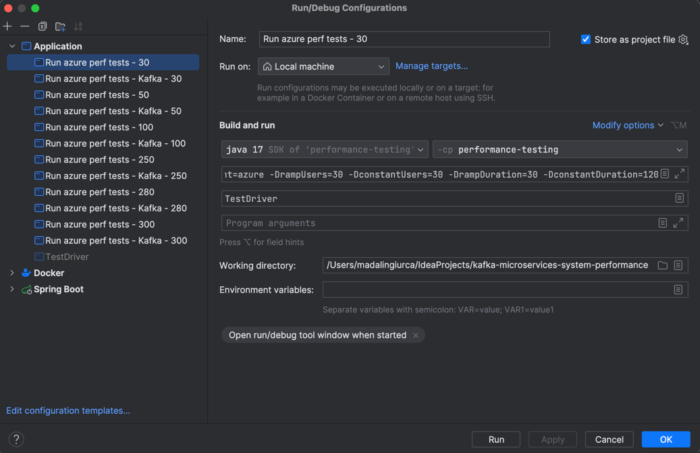

# Laboratory setup for Kafka and REST communications

Laboratory setup that encapsulate a logic of order processing. The services in place are created in such a way that
multiple types of interprocess communications can be used. Using the docker compose files provided,
someone can boot the setup by using REST HTTP calls or a Kafka bus. See files under __docs__ directory
for more information

## Getting Started

### Dependencies

* Java
* Maven
* Docker

### Build

* Use maven to build the project
```shell
mvn clean install
```

### Executing program

* Build the project using Maven
* Use docker to start the setup in either REST or Kafka
  * REST
  ```shell
  docker compose -f docker-compose-rest.yaml up
  ```

  * Kafka
  ```shell
  docker compose -f docker-compose-kafka.yaml up
  ```

* (Optional) To test the performance, under [performance-testing](performance-testing) directory
there's a Gatling setup of performance tests.
* Feel free to use and/or modify the existing Idea configurations for running performance tests
  